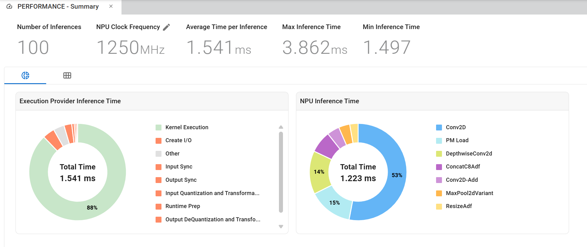

# yolox_nano_int8

YOLOX-Nano INT8 model evaluation and compilation for AMD VEK385 (VAIML / Ryzen AI NPU).

This repo evaluates the INT8 YOLOX-Nano ONNX model on COCO val2017 (mAP via
pycocotools), and compiles it for the VEK385 board. Inference can run on CPU or
on the NPU via the VitisAI Execution Provider.

The model compiled for the NPU here is `yolox_nano_onnx_pt_regular_conv_all.onnx`, a
variant of the INT8 model in which selected depthwise Convs are rewritten as
mathematically-equivalent regular (dense) Convs (see step 1).

## Repo layout

```
compile.py                       # Compile the model for VEK385 (VitisAI EP, target VAIML)
evaluate.py                      # COCO mAP evaluation (CPU / NPU), dump / from-results split
preprocess.py                    # Image preprocessing (letterbox resize, BCHW)
postprocess.py                   # Decode + class-aware NMS
vitisai_config.json              # VitisAI partition config (device ve2, optimize_level 4, tp_size 5)
onnx_model/
  yolox_nano_onnx_pt_regular_conv_all.onnx # INT8 QDQ model, depthwise Convs -> regular Convs (used here)
  yolox_nano_onnx_pt.onnx              # INT8 QDQ model (source)
  yolox_nano.onnx                      # float reference model
```

## 1. Get the model

The INT8 model comes from the Xilinx YOLOX-Nano package:

```
https://www.xilinx.com/bin/public/openDownload?filename=pt_yolox-nano_3.5.zip
```

The model used in this repo, `onnx_model/yolox_nano_onnx_pt_regular_conv_all.onnx`, is
the INT8 model with selected depthwise Convs rewritten as regular (dense) Convs.
This is mathematically equivalent (bit-exact outputs) but compiles more
efficiently on the NPU. It is already provided here, so no download or conversion
is required — use `onnx_model/yolox_nano_onnx_pt_regular_conv_all.onnx` for the steps
below.

## Dataset

COCO val2017 is expected at `../datasets/coco` with the layout:

```
../datasets/coco/annotations/instances_val2017.json
../datasets/coco/images/val2017/*.jpg
```

Use `--coco-root <path>` if your dataset lives elsewhere.

## 2. Evaluate on CPU (host)

```bash
python3 evaluate.py --model onnx_model/yolox_nano_onnx_pt_regular_conv_all.onnx --coco-root ../datasets/coco
```

Expected output:

```
 Average Precision  (AP) @[ IoU=0.50:0.95 | area=   all | maxDets=100 ] = 0.209
 Average Precision  (AP) @[ IoU=0.50      | area=   all | maxDets=100 ] = 0.367
 Average Precision  (AP) @[ IoU=0.75      | area=   all | maxDets=100 ] = 0.216
 Average Precision  (AP) @[ IoU=0.50:0.95 | area= small | maxDets=100 ] = 0.069
 Average Precision  (AP) @[ IoU=0.50:0.95 | area=medium | maxDets=100 ] = 0.219
 Average Precision  (AP) @[ IoU=0.50:0.95 | area= large | maxDets=100 ] = 0.336

mAP@[.5:.95] = 0.2090
mAP@.5       = 0.3673
```

For reference, the float (FP32) model `onnx_model/yolox_nano.onnx` can be
evaluated the same way:

```bash
python3 evaluate.py --model onnx_model/yolox_nano.onnx --coco-root ../datasets/coco
```

Expected output:

```
mAP@[.5:.95] = 0.2210
mAP@.5       = 0.3683
```

## 3. Compile for VEK385

Run inside the v6.3 release docker:

```bash
python3 compile.py
```

This creates a VitisAI inference session that partitions and compiles the model
for the NPU (target `VAIML`, device `ve2`, `optimize_level = 4`, `tp_size = 5`).
The compilation artifacts are cached under `./` using
`cache_key = yolox_nano_onnx_pt_regular_conv`.

## 4. Run on the VEK385 board (NPU)

First install tqdm on the board:

```bash
python3 -m pip install tqdm
```

Then run inference on the NPU and dump detections to JSON. pycocotools is not
available on the board (architecture-specific native extension), so we only
collect detections here and compute mAP later on the host.

```bash
python3 evaluate.py \
    --model onnx_model/yolox_nano_onnx_pt_regular_conv_all.onnx \
    --coco-root ../datasets/coco \
    --target NPU \
    --cache_key yolox_nano_onnx_pt_regular_conv \
    --dump-results dumped_yolox_nano_onnx_pt_regular_conv.json
```

This writes the collected detections to
`dumped_yolox_nano_onnx_pt_regular_conv.json`. Copy that file back to the host
and compute mAP as shown next.

## 5. Compute mAP on the x86 host

Copy the dumped JSON back to the host and compute mAP with pycocotools. If the
COCO dataset is in a different location than the script default, pass
`--coco-root`.

```bash
python3 evaluate.py --coco-root ../datasets/coco --from-results dumped_yolox_nano_onnx_pt_regular_conv.json
```

Expected output:

```
Loading detections from: dumped_yolox_nano_onnx_pt_regular_conv.json
...
 Average Precision  (AP) @[ IoU=0.50:0.95 | area=   all | maxDets=100 ] = 0.190
 Average Precision  (AP) @[ IoU=0.50      | area=   all | maxDets=100 ] = 0.343
 Average Precision  (AP) @[ IoU=0.75      | area=   all | maxDets=100 ] = 0.192
 Average Precision  (AP) @[ IoU=0.50:0.95 | area= small | maxDets=100 ] = 0.062
 Average Precision  (AP) @[ IoU=0.50:0.95 | area=medium | maxDets=100 ] = 0.192
 Average Precision  (AP) @[ IoU=0.50:0.95 | area= large | maxDets=100 ] = 0.310
 Average Recall     (AR) @[ IoU=0.50:0.95 | area=   all | maxDets=  1 ] = 0.198
 Average Recall     (AR) @[ IoU=0.50:0.95 | area=   all | maxDets= 10 ] = 0.326
 Average Recall     (AR) @[ IoU=0.50:0.95 | area=   all | maxDets=100 ] = 0.355
 Average Recall     (AR) @[ IoU=0.50:0.95 | area= small | maxDets=100 ] = 0.126
 Average Recall     (AR) @[ IoU=0.50:0.95 | area=medium | maxDets=100 ] = 0.390
 Average Recall     (AR) @[ IoU=0.50:0.95 | area= large | maxDets=100 ] = 0.552

mAP@[.5:.95] = 0.1904
mAP@.5       = 0.3427
```

## 6. Performance (VART)

For performance measurement we use **VART**, not the ONNX Runtime Execution
Provider.

Example command to benchmark on the board:

```bash
ml_vart --app-config vart_config.json --dry-run --benchmark --runs 100
```

The VART profiling summary (see `perf_vart.png`) reports an **Average Time per
Inference = 1.541 ms** (~649 FPS at an NPU clock of 1250 MHz), of which the
**NPU inference (kernel) time = 1.223 ms**.



## Results summary

| Target       | mAP@[.5:.95] | mAP@.5 |
|--------------|-------------:|-------:|
| CPU (FP32)   | 0.2210       | 0.3683 |
| CPU (INT8)   | 0.2090       | 0.3673 |
| NPU (VEK385) | 0.1904       | 0.3427 |
